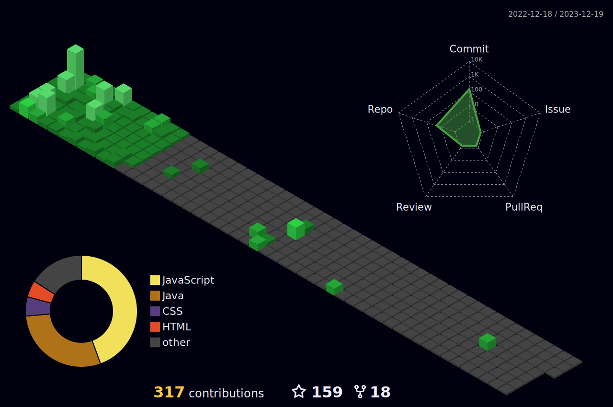

<h1 align="center">Hi , I'm Abhinav</h1>
<h3 align="center">I'm a passionate Back-End Developer .</h3>

## 1. 🙋‍♂️ About Me

- 🌱 I’m currently learning **Data Structures and Algorithms.**

- 👯 I’m looking to collaborate on **OpenSource Projects**

- 📫 How to reach me **abhinavdonadkar800@gmail.com**

- ⚡ Fun fact **I play games and go to the GYM very often.**

## 2. Familiar Tech Stack:

<!-- coding boy -->

<!-- language -->

 

## 3. Used Tools:

 
 
 
 
  
<h2 align="center">📊 My Github Stats<h2>

 
 

   
  

  
  

  

 

## 4. Connect with me:

## 5. ❤ Views and Followers

